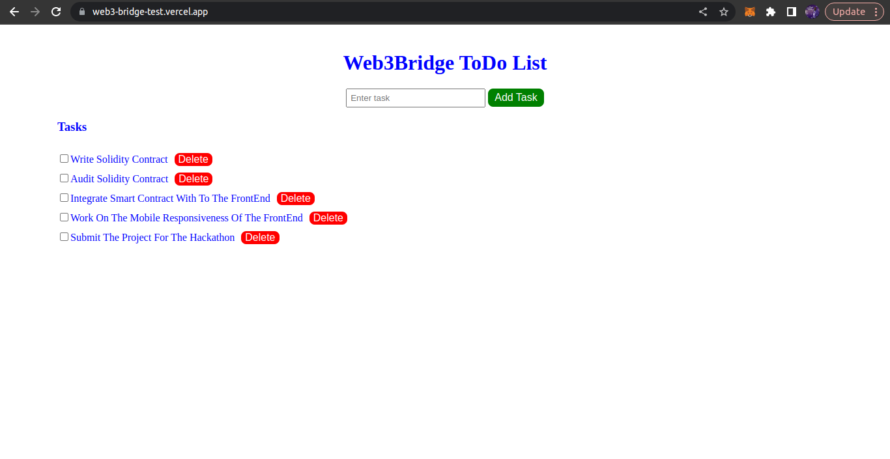
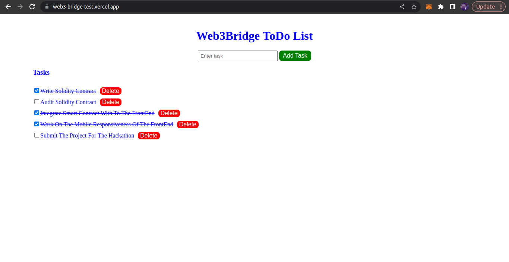
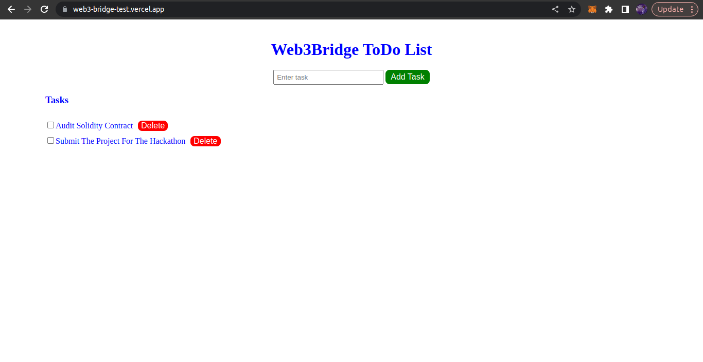

# TodoList App

## Description:

- A simple TodoList App that allows user to enter a task in the input field and clicks on the Add button, to add the Task to the TodoList.
- It display the Todo List below the form, showing all the tasks added.
- Each task have a checkbox next to it, which allows a user to mark a task as completed.
- When the user checks (mark it as completed ) a task, and it crosses out on the list.

- The App has a button that allows a user to delete a completed task from the list.

## Demo Live Link

The App is hosted with vercel and available here
Demo Link: https://web3-bridge-test.vercel.app/

## Sample Output

This is the simple UI of the App showing All Tasks entered by the user, Completed Task(with strike through effect) and Remaining Task (After Deleting completed Task)

### All Task

All Task entered by a user

### Completed Task

Task completed by a user

### Remaining Task

Remaining Task After Deleting Completed Task

